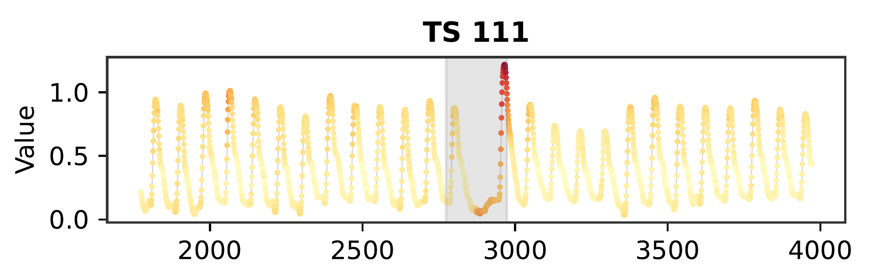

# Granularity misalignments in time series anomaly detection

Granularity-aware evaluation for **time-series anomaly detection (TSAD)**, the
clean, reusable implementation behind the paper *"Granularity misalignments in
time series anomaly detection"*.



*UCR series 111: a point-dense sequence-anomaly (shaded), with the curve colored
by the aggregated point-wise anomaly score (red = high). Reproduce heatmaps like
this on any UCR series with `scripts/heatmap_from_scratch.py`.*

The package separates the three granularities discussed in the paper — **data**,
**models** and **metrics** — and provides:

1. **Metrics** (`granularity_tsad.metrics`): point-wise `f1_point`,
   sequence-wise `f1_seq`, and PAK-based `f1_pak` / `f1_wpak` (stretched WPAK)
   given scores and the UCR ground truth.
2. **Analysis & figures** (`granularity_tsad.aggregation`, `.clustering`,
   `.plots`): score aggregation, point-detectability profiles, hierarchical
   clustering, dendrogram, per-granularity boxplots, PAK/WPAK curves and
   Bayesian comparisons (`baycomp`).
3. **Heatmap from scratch** (`scripts/heatmap_from_scratch.py`): run point-wise
   EasyTSAD detectors on a single series, aggregate their scores, and plot the
   series colored by the aggregated anomaly score.

## Installation

```bash
pip install -r requirements.txt
pip install -e .          # optional: install the package itself
```

`tadpak`, `prts` and `baycomp` are required for the metrics and Bayesian plots.

**Running detectors from scratch** (scripts 1 and `heatmap_from_scratch.py`)
additionally needs:

* [EasyTSAD](https://github.com/dawnvince/EasyTSAD) (GPL-3.0) and its detector
  dependencies: `toml`, `torchinfo`, `torch`, `torch_optimizer`,
  `pytorch_lightning`, `tqdm`, ... (it imports all built-in detectors on load).
* For the `MyAlgo_*` wrappers: `pyod`, `pyrcn`, `transformers`, and the
  `tsdalia` library (`pip install -e <path>/tsadalia`).

These libraries are vendored under `lib/` (`lib/EasyTSAD/EasyTSAD` and
`lib/tsadalia/tsdalia`) so the benchmark is reproducible out of the box; their
virtualenvs and caches are git-ignored. The `MyAlgo` imports also resolve the
pip-installed packages (`EasyTSAD`, `tsdalia`) if you prefer to install them.
See the **Licensing** section below regarding the bundled third-party code.

## Layout

```
granularity_tsad/
├── config/paper.yaml              # paths, detectors, k-grid
├── granularity_tsad/              # the importable package
│   ├── config.py                  # config + repo paths
│   ├── data.py                    # UCR loading, targets, score/target alignment
│   ├── aggregation.py             # score aggregation + detectability profiles
│   ├── clustering.py              # agglomerative clustering of series
│   ├── easytsad_runner.py         # thin EasyTSAD wrapper
│   ├── metrics/                   # f1_point, f1_seq, f1_pak, pak/wpak curves
│   └── plots/                     # style, heatmap, boxplots, pak_curves, bayesian, dendrogram
├── scripts/
│   ├── 1_run_detectors.py         # run EasyTSAD benchmark -> Results/Scores
│   ├── 2_compute_metrics.py       # scores -> f1_point/f1_seq/f1_pak/f1_wpak CSVs
│   ├── 3_generate_figures.py      # dendrogram, profiles, boxplots, bayesian (Fig 6-12)
│   └── heatmap_from_scratch.py    # single-series heatmap end to end
├── lib/                           # vendored deps + custom detectors
│   ├── EasyTSAD/                  # EasyTSAD benchmark (GPL-3.0)
│   ├── tsadalia/                  # tsdalia models (MIT)
│   └── MyAlgo/                    # custom EasyTSAD detector wrappers (MIT)
└── data/                          # raw UCR data + cached metrics (gitignored)
```

## Quickstart

Compute the metrics from cached scores and render the paper figures:

```bash
python scripts/2_compute_metrics.py     # -> data/metrics/f1_{point,seq,pak,wpak}.csv
python scripts/3_generate_figures.py    # -> figures/ (dendrogram, profiles, boxplots, bayesian)
```

`3_generate_figures.py` clusters the series by point-detectability (Fig 6-7),
plots per-cluster metric boxplots (Fig 9), and runs the Bayesian point-wise vs
sequence-wise comparison per cluster for `F1_PAK` (Fig 10) and the stretched
`wF1_PAK` (Fig 12), with the ROPE calibrated as `0.5 * MAD` per metric.

Build a heatmap for a single UCR curve end to end (needs EasyTSAD):

```bash
python scripts/heatmap_from_scratch.py --curve 91 \
    --methods AE Donut EncDecAD FCVAE LSTMADalpha --output figures/heatmap_91.pdf
```

### Metrics API

```python
from granularity_tsad.metrics import f1_point, f1_seq, f1_pak, f1_wpak

f1p = f1_point(scores, targets)   # point-wise F1 (no point adjustment), via tadpak
f1s = f1_seq(scores, targets)     # range-based F1 (Tatbul et al.), via prts.ts_fscore
f1k = f1_pak(scores, targets)     # area under the PAK F1 curve, via tadpak
wfk = f1_wpak(scores, targets)    # stretched WPAK: down-weights high-coverage k
```

`f1_seq` sweeps detection thresholds and returns the best range-based F-score
using `prts.ts_fscore` with the package default parameters.

## Data

All datasets used in this work are public and come from the **UCR Time Series
Anomaly Detection** archive (Keogh et al., 2021), available at
<https://www.cs.ucr.edu/~eamonn/time_series_data_2018/>.

The series are bundled in this repository under
`data/raw/UCR_Anomaly_FullData/` to guarantee availability and reproducibility
in case the original archive becomes unavailable or unstable. Score arrays and
intermediate caches (`*.npy`, `*.pkl`, the original `*.zip`, etc.) remain
gitignored and are regenerated by the pipeline.

## Licensing

This project's own code — the `granularity_tsad` package, the `scripts/`, and
the `lib/MyAlgo` detector wrappers — is released under the **MIT License**
(see `LICENSE`).

The rest of `lib/` bundles third-party libraries, each kept under its own
license:

* `lib/EasyTSAD` — the EasyTSAD benchmark, licensed **GPL-3.0**
  (see `lib/EasyTSAD/LICENSE`).
* `lib/tsadalia` — TECNALIA's `tsdalia` library, licensed **MIT**
  (see `lib/tsadalia/LICENSE`).

Note that EasyTSAD is distributed under the copyleft GPL-3.0 license. It is
included here unmodified for reproducibility and is only required to run the
detectors from scratch (scripts 1 and `heatmap_from_scratch.py`); the metric
and figure pipeline (scripts 2 and 3) does not import it. If you redistribute
this repository, keep each bundled library under its original license.
